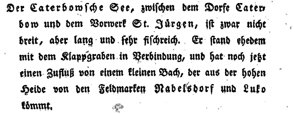

# Herkunft und Bedeutung des Namens *Katerbow*
Der Familienname *Katerbow* ist auf den Ortsnamen *Katerbow* zurückzuführen, in beiden Fällen wird der Name [kaːtɐboː] ausgesprochen. 

Für Familiennamen des Deutschen ist im Allgemeinen bekannt, dass die &bdquo;heutigen Kennzeichen der Familiennamen, daß sie gesetzlich geschützt sind … und daß sie vererbt werden&rdquo; (König 2001, S. 125), noch für das Mittelalter kaum zutreffen. Es lässt &bdquo;sich insgesamt sagen, daß die Zweinamigkeit (und in ihrer Folge der Brauch, Familiennamen zu führen) im Schrifttum süd- und westdt. Städte Anfang 12. Jh. sichtbar wird, … nach Norden und Osten fortschreitet und Anfang 15. Jh. im wesentlichen vollzogen ist&rdquo; (Kunze 1998, S. 61).

## Der Ortsname *Katerbow*
Die auslautende Silbe *-ow*, gesprochen -[oː], kann auf einen slawischen Ursprung des Namens *Katerbow* hinweisen, allerdings kann es sich auch um die ursprünglich mittelniederdeutsche Silbe -*auwe*, mit der Bedeutung ‘Aue’ handeln (siehe auch: [Namen auf -ow](http://de.wikipedia.org/wiki/Namen_auf_-ow)). Das heißt, es lassen sich in der Mark Brandenburg einerseits Ortsnamen finden, die heute mit -*ow* geschrieben werden und auf eine slawische Silbe zurückgeführt werden können und andererseits lassen sich ebenso Ortsnamen nachweisen, die heute zwar ebenfalls mit -*ow* geschrieben werden, die aber nicht auf eine slawische Silbe sondern auf eine germanische Silbe zurückgeführt werden können.

### Herkunft der finalen Silbe -*ow*
In Bezug auf die finale Silbe -*ow* in Ortsnamen der Mark Brandenburg ist nach Fischer 2005 die &bdquo;Annahme, daß alle auf -*ow* auslautenden Ortsnamen slawischer Herkunft sind, falsch. Es gibt auch viele deutsche Ortsnamen, die heute in der Schriftform auf -*ow* auslauten&rdquo; (Fischer 2005, S. 203). Die heute auf -*ow* auslautenden Ortsnamen können nach Fischer (2005, S. 204) sein:
> 1. slawische Ortsnamen, die von einem Personennamen gebildet wurden. Hier hat das Suffix -*ov* die gleich Funktion wie das Suffix -*in*. Von den 444 heute auf -*ow* auslautenden Namen in den Ländern Brandenburg und Berlin (Namen mit Zusätzen wie Bochow und Neu Bochow werde als ein Name gerechnet) zählen hierher 184 Namen: *Bagow*, *Bochow* und andere.
> 2. slawische Ortsnamen, die mit dem Suffix -*ov* von Appellativen gebildet wurden, z.B. *Buckow*, gebildet von *buk* ›Rotbuche‹, also ›Rotbuchenort, Ort, wo Rotbuchen wachsen‹. Es sind adjektivische Namen, das Substantiv ›Siedlung, See, Wald‹ oder ähnlich muß man sich denken, wie man auch im Deutschen sagt, man geht in die Wilmersdorfer einkaufen, Straße läßt man weg. Hierher zählen 166 Namen: *Buckow*, *Grabow* und andere.
> 3. deutsche Ortsnamen mit dem Grundwort Aue, siehe -*au(e)*. Lautlich ist mittelniederdeutsch *ouwe* ›Aue‹ mit dem eingedeutschen slawischen Suffix zusammengefallen, oder die Namen wurden einander angeglichen. Hierher zählen 34 Namen: *Lindow*, *Reichenow* und andere.
> 4. deutsche, übertragene und slawische Ortsnamen, an die seit dem 6. Jahrhundert das -*ow* als typisches Ortsnamenmerkmal angefügt wurde, vergleichbar dem -*a* im mitteldeutschen Sprachgebiet, siehe -*a*. Durch das Anfügen von -*ow* konnte man gleichlautende Ortsnamen voneinander unterscheiden (*Kriele* — *Krielow*), oder der Name wurde von einem Appellativum unterschieden (*Eiche* — *Eichow*). Hierher gehören 42 Ortsnamen, davon 30 ursprünglich slawisch: *Teurow*, *Thyrow* und andere.
> 5. Zwölf Namen sind deutscher Herkunft oder übertragene Namen: *Eichow*, *Glindow*, *Krielow* und andere.
> 6. slawische Namen, die nicht mit dem Suffix -*ov* gebildet wurden, sondern deren Stamm auf -*ov*- oder auf eine ähnlich lautende Verbindung (-*av*-, -*ev*-, -*og*) endete. Hierher gehören 19 Namen: *Batzlow*, *Ostrow*, *Saarow*, *Sacrow*, *Wustrow* und andere.
> 7. Ein junger Ortsname ist ursprünglich ein Familienname: *Parlow*.

Hinweis: Entgegen den Überlegungen von Fischer (2005, S.204) geht 110 Jahre vor ihm Hammer (1895, S. 23) fest davon aus, dass *Lindow* nicht auf 'Linden-Aue' zurückgeführt werden kann, sondern dass hier asl. *ledina* ‘unbebautes Land’ heranzuziehen sei.

### Herkunft der finale Silbe -*au(e)*
Die finale Silbe -au(e) in Ortsnamen der Mark Brandenburg kann nach Fischer (2005, S. 194) zurückgehen auf:
> 1. das zur Ortsnamenbildung verwendete -*au(e)* im Mittelalter, mittelhochdeutsch *ouwe* ›Land am Wasser, nasse Wiese, Insel‹, mittelniederdeutsch *ouwe* ›vom Wasser umflossenes Land, wasserreiches, grasiges Land, Aue‹: *Breitenau*, *Fürstenaue*, *Grassau*, *Lindenau* und andere.
> 2. das zur Namenbildung verwendete -*au(e)* bei Ortsnamen, die seit dem 18. Jh. entstanden. Hier ist -*au(e)* eher ein Modewort zur Ortsnamenbildung, ein Bezug zur Lage in einer Niederung braucht nicht vorhanden zu sein: *Charlottenau*, *Elisenau*, *Friedenau*, *Frohnau*, *Wittenau* und andere.
> 3. das Suffix -*ow*, mit dem slawische Namen gebildet wurden: *Beesdau*, *Bohrau*, *Buckau*, *Spandau* und andere
> 4. eine Kanzleiform des Namens. Das -*au* wurde seit dem 16. Jahrhundert als typisches Ortsnamenmerkmal an Namen angefügt, vergleichbar -*a* und -*ow*: *Altenau*, *Altnau*, *Krugau*, *Lieskau*, *Lugau*.
> 5. andere Herkunft in Einzelfällen: *Dubrau*, *Prenzlau*, *Wustrau* (auslautendes -*av*- oder -*ov*- bei slawischen Namen), Markau (übertragener Name).

### Die Silbe -*ow* im Ortsnamen *Katerbow*
Wie es sich nun mit der finalen Silbe -*ow* in dem Ortsnamen *Katerbow* verhält, konnte bisher nicht eindeutig geklärt werden. Die synchrone und zumindest bis 1358 zurückgehende diachrone Graphie lässt allerdings hinsichtlich der Aussprache keine Silbentrennung vor -*ow* zu, sodass die finale Silbe im Ortsnamen immer -*bow* war. Folgt man dieser phonotaktischen Interpretation, dann wäre keine der oben genannten Interpretationsmöglichkeiten mehr möglich. Sodass sich eine andere Bedeutung des Namens finden lassen muss (siehe: Semantik des Ortsnamens).

### Diachrone Graphie-Varianten des Ortsnamens
Nach Foster 1998, S. 75, Artikel 139:
> **Katerbow** (Ostprignitz-Ruppin/Neuruppin), Dorf nw. Neuruppin. 
> 1358 tu Katerbowe (MUB XIV 285) 
> 1427 katherbow (A I 182 Or.) 
> 1495 Katerpaw (A IV 142 Or.) 
> 1540 Catrebow (Gaterbow) (A VII 272 Or.) 
> 1614 in Katerbow (Bonin 248) 
> 1775 Caterbow (Büsching 44) 
> 1861 Katerbow (Katerbau) (Boeckh 210) 

Nach Hammer 1895, S. 26:
> **Katerbow**, 
> 1491 Katerbouw 
> 1580 Catrebow und Gaterbow

### Der Gewässername des Katerbower Sees
Unweit südlich des Ortes Katerbow erstreckt sich der etwa 53ha große, 2km lange und max. 3m tiefe Katerbower See (Koordinaten: 52°58’47″N 12°39’28″E, Gewässernummer: 1462, [Google Maps](https://maps.google.de/?ie=UTF8&ll=52.982292,12.669725&spn=0.029507,0.077162&t=h&z=14&output=embed)). Der kleine See gehört zu den Ausläufern der Mecklenburgischen Seenplatte. 1799 beschreibt F. W. A. Bratring den Caterbowschen See folgendermaßen:

Nach Foster (1998, S. 152) ist der See nach dem Ort benannt. Dabei sind die &bdquo;sind die verschiedenen Bezeichnungen für den See [interessant], vor allem in den ersten beiden Belegen, in denen der See auf indirekter Weise genannt wird&rdquo; (Foster 1998, S. 152). Diese sind in chronologischer Reihenfolge nach Foster (1998, S. 152):

> 1358 see tu Katerbowe (MUB XIV 285), 
> 1516 Item die Sehe zu Caterbow (A IV 419 Kop.), 
> 1530 an den sehenn katterbu gelegen (A IV 453 Or.), 
> 1590 die See Katerbow genandt (ER Ruppin fol. 235), 
> 1692 auff dem Caterbowschen See (Bonin 304), 
> 1772 Caterbau-See (Schirmeister 121), 
> 1825 Der Katerbowsche See (UMbl. 1547)

## Die Semantik des Ortsnamens *Katerbow*
Nach Foster (1998, S. 192) handelt es sich bei dem Ortsnamen *Katerbow* um einen Namen,  der &bdquo;aus verschiedenen Gründen nicht klassifiziert werden konnte, obwohl … [er] eindeutig [ein] Name slawischer Herkunft&rdquo; ist. Die Autorin gibt an, dass &bdquo;[t]rotz relativ früher Überlieferung … der Name nicht befriedigend zu erklären&rdquo; (Foster 1998, S. 75) ist. Sie bietet folgende Grundformen an:

> - &bdquo;Gf. Aplb. *Kotarbov- ‚Dorf eines Kotarba’, zum PN aplb. *Kotarba, vgl. PN p. Kotarba, Koterba (Rospond SNSl 2, 382), č. Kotrba (Svoboda 195). Die PN werden von Rospond (ebd.) zu p. kotarba ‚Kopf’, č. Kotrba ‚großer Kopf’ gestellt. Das Auftreten des Appellativums scheint sich jedoch auf den tschechischen und südpolnischen Sprachraum zu beschränken.Vgl. ON p. Kotarby (SG 4, 941), FIN p. Kotarba (BG 125).&rdquo; (Foster 1998, S. 75)
> - &bdquo;Gf. Aplb. *Kotirbov- ‚Ort, wo es Faulbäume gibt’, zu aplb. *kotirba > *koterba, vgl. p. kocierba, kocierpka ‚Faulbaum’, zu p. cierpnąć, ursl. *tƅrp-něti ‚leiden; urspr. erstarren, kribbeln’. Auch dieses App. mit dial. Unterschiedlicher Wortbildung ist isoliert, vgl. č. Dial. trpka, trpula, trpiška ‚eine Sorte von herben, bitteren Birnen’, nso. Póśerpina ‚Faulbaum’, ukr. dial. koćerpka, koćirba, koćuba ‚dass.’ (SEJP 2, 316f.). Mit diesem Appelativum gebildete VglN wurden nicht gefunden&rdquo; (Foster 1998, S. 75).

Eine weitere (laienhafte) Interpretation der Bedeutung des Ortsnamens *Katerbow* findet sich in der Ortschronik von Katerbow, die mir als Abschrift von einer Persoon aus Katerbow zur Verfügung gestellt wurde. Die Chronik wurde nach Aufzeichnungen von Herrn Knöllner in den Jahren zwischen ca. 1930 bis 1945 geschrieben; der Quellennachweis liegt laut Knöllner der Originalchronik bei, deren Verbleib allerdings unbekannt ist.

> - Es soll ein slawischer Name sein, der soviel wie 'Raufplatz' bedeutet. Katerbow liegt an einem wichtigen Übergang zwischen dem Temnitz- und Klappgrabental und in den ältesten Zeiten mag in diesen Gegenden weidlich gerauft worden sein. Hat doch vom 9. bis 13. Jahrhundert ein steter Grenzkrieg zwischen Deutschen und Wenden stattgefunden und &bdquo;Das Gebiet von endlosen Fehden zwischen dem Grafen, Raufrittern, Städten und anderen feindlichen Parteien wild durchwogt gewesen&rdquo; Die Sage von der Riesenschlacht bei Netzeband weist wahrscheinlich auch auf jene Vorgänge hin, die sich in früherer Zeit hier abgespielt haben. Das ehemals sehr sumpfige Temnitztal, dessen schmalste Verbindung sich zwischen der heutigen Katerbower Mühle und dem Netzebander Dandkrug befand, war einst eine Völkerscheide zwischen Witzen und Obotriten, und es mag hier um diesen Übergang nach damaligen Begriffen eine gewaltige Völkerschlacht getobt haben.
> - Nach einer anderen Leseart soll der Name aus “Katka” (eine Tracht Schläge) und  (“terebljuß”) gerauft oder gerittelt entstanden sein.
> - Andererseit weist man auf die Zusammensetzung aus den deutschen Wörtern “Katen (Hütte) und “Bau” hin.

## Literatur
Reinhard E. Fischer (2005): Die Ortsnamen der Länder Brandenburg und Berlin. Alter – Herkunft – Bedeutung. be.bra Wiss.-Verlag, Berlin, 2005, ISBN: 978-3-937233-30-7.

Elzbieta Foster (1998): Brandenburgisches Namenbuch. Teil 11: Die Ortsnamen des Landes Ruppin. Mit einem siedlungsgeschichtlichen Beitrag von Christa Plate

Wilhelm Hammer (1895): Ortsnamen der Provinz Brandenburg. II. Teil.. R. Gaertners Verlagsbuchhandlung, Berlin, 1895.
